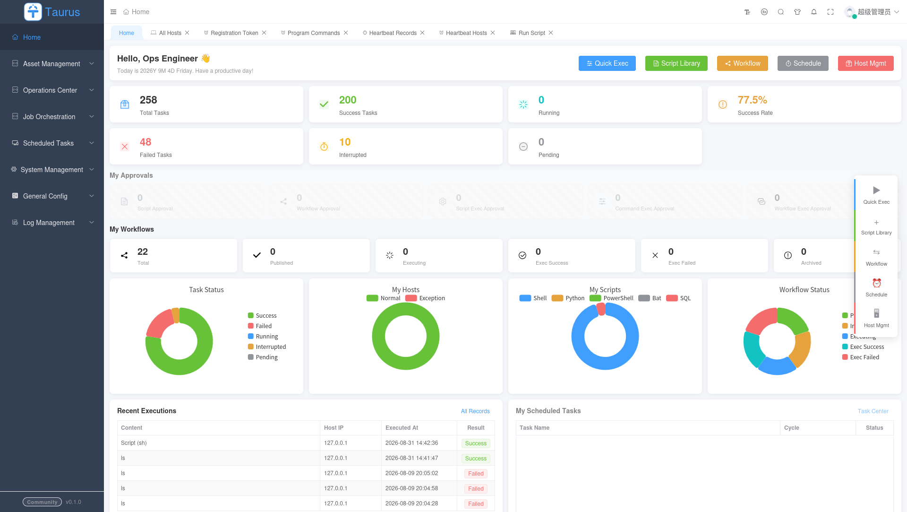
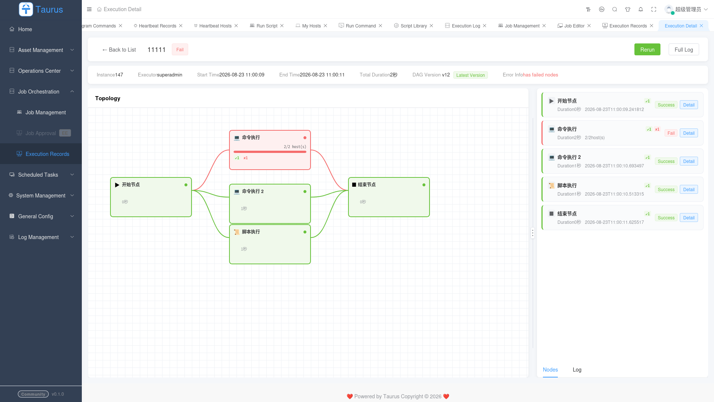
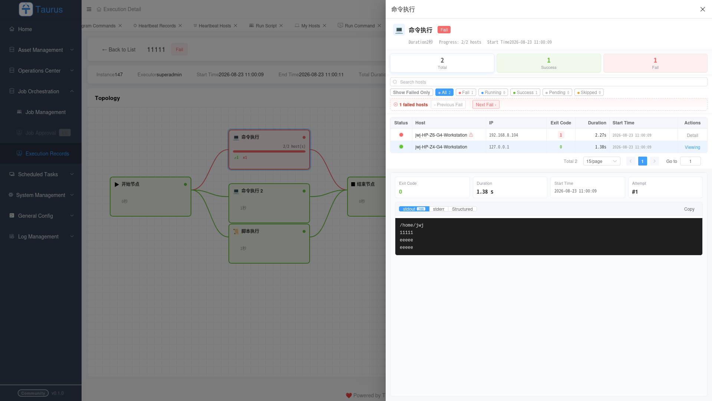
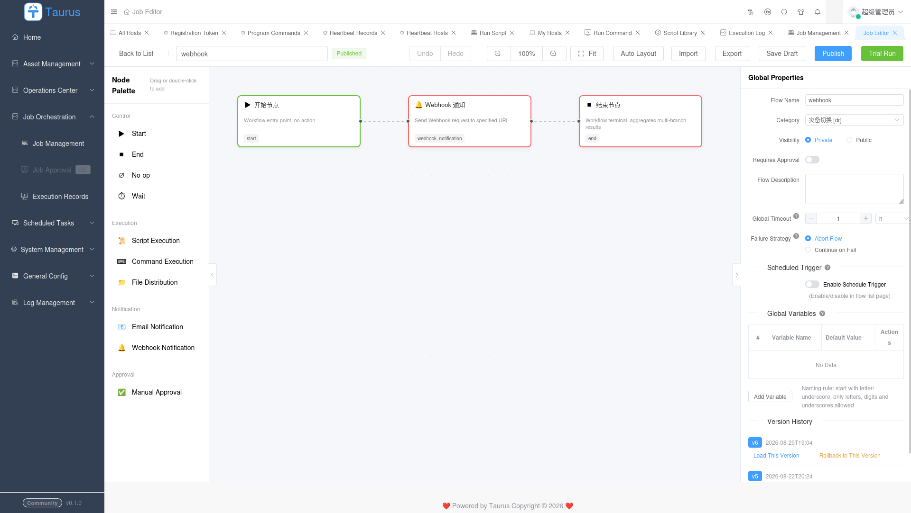
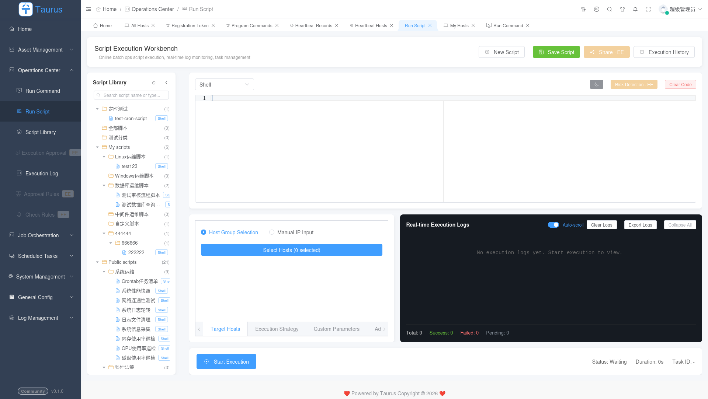
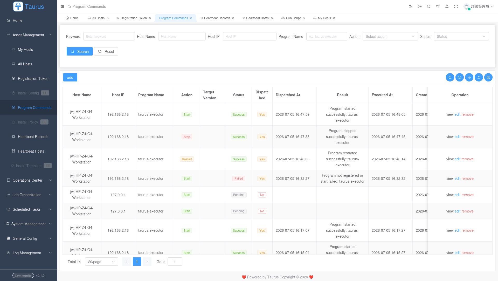
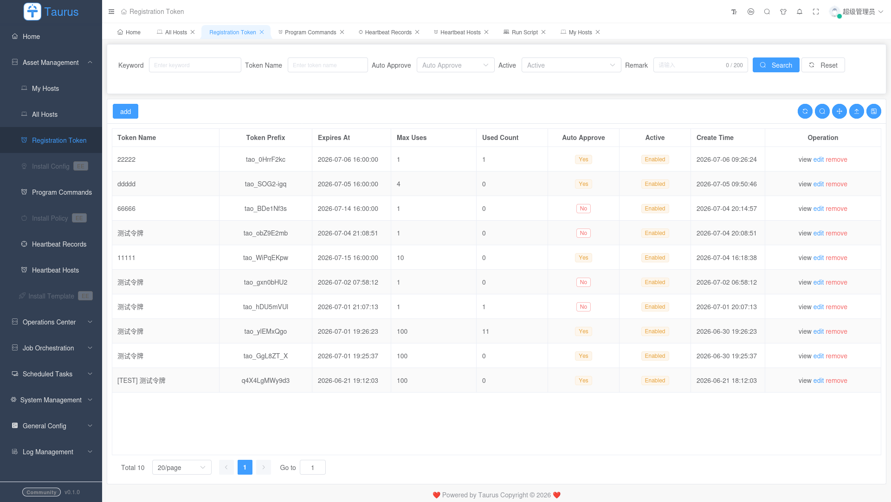

# Taurus Stack

<div align="center">

**分布式运维管理平台**

[English](README.md) | [中文](README.zh-CN.md)

[](LICENSE)
[](https://www.python.org/)
[](https://vuejs.org/)
[](https://www.typescriptlang.org/)
[](https://taurus-stack.github.io/taurus-portal/)
[](#community-edition)
[](#enterprise-edition)

</div>

---

## 项目简介

Taurus Stack 是一套完整的分布式运维管理系统（堡垒机 / 运维管理平台），用于远程主机管理、命令执行、系统健康监控。提供安全、可扩展、高可靠的基础设施管理能力。

同一套代码库，两个版本：

|                | **社区版 Community** | **企业版 Enterprise**          |
| -------------- | ----------------- | --------------------------- |
| **协议**         | AGPL-3.0 开源       | 商业授权                        |
| **Feature 数量** | 37 / 77           | 77 / 77                     |
| **工作流引擎**      | 基础编排              | 全功能 + 审批 + DAG              |
| **高可用**        | 单实例               | Redis HA + Leader 选举        |
| **审批流**        | ❌                 | ✅ 脚本/程序/工作流审批               |
| **通知**         | ❌                 | ✅ 邮件 + Webhook + 回调         |
| **多主机执行**      | ❌                 | ✅ 串行/并行/批量                  |
| **License 系统** | ❌                 | ✅ RSA-PSS-SHA256 签名 License |
| **源码**         | 完全开源              | `taurus_ee/` 闭源包            |

> 🔒 **安全声明**：企业版代码位于独立私有仓库。社区版仓库**零私钥、零签发代码**，`taurus_ee/` 被永久 gitignore。详细分离设计见 [docs/editions.md](docs/editions.md)。

---

## 功能截图

### 仪表盘 & 主机管理

| 首页仪表盘                               |
|:-----------------------------------:|
| [](img/home.png) |
|                                     |
|                                     |
|                                     |

### 任务管理

| 任务管理                                                      | 任务执行详情                                                        | 任务节点执行详情                                                                  |
|:---------------------------------------------------------:|:-------------------------------------------------------------:|:-------------------------------------------------------------------------:|
| [](img/job-management.png) | [](img/job-exec-detail.png) | [](img/job-node-exec-detail.png) |

| 执行记录                                                            | 执行日志                                                    | 运行详情                                              | 重新运行                                    |
|:---------------------------------------------------------------:|:-------------------------------------------------------:|:-------------------------------------------------:|:---------------------------------------:|
| [](img/execution-records.png) | [](img/execution-log.png) | [](img/run-detail.png) | [](img/rerun.png) |

### 脚本与命令

| 脚本库                                                      | 运行脚本                                              | 程序命令                                                          | 运行命令                                                |
|:--------------------------------------------------------:|:-------------------------------------------------:|:-------------------------------------------------------------:|:---------------------------------------------------:|
| [](img/script-library.png) | [](img/run-script.png) | [](img/program-commands.png) | [](img/run-command.png) |

### 注册

| 注册令牌                                                              |
|:-----------------------------------------------------------------:|
| [](img/registration-token.png) |

---

## 架构总览

```
┌─────────────────────────────────────────────────────────────────────────────┐
│                              Taurus Stack 架构                               │
├─────────────────────────────────────────────────────────────────────────────┤
│                                                                             │
│   ┌──────────────┐  HTTP/REST+JWT   ┌──────────────────────────────────┐  │
│   │   Taurus Web  │ ───────────────►│        Taurus Backend              │  │
│   │   (Vue 3)     │ ◄────────────── │      (Django 4.2 + dvadmin)       │  │
│   └──────────────┘  WebSocket        │                                   │  │
│                                       │  ┌──────────────────────────┐   │  │
│                                       │  │   Edition Gate            │   │  │
│                                       │  │  (edition + license.valid)│   │  │
│                                       │  └──────────┬───────────────┘   │  │
│                                       │             │ EE 特性自动发现    │  │
│                                       │     ┌───────▼───────────────┐   │  │
│                                       │     │ taurus_ee/  (EE only) │   │  │
│                                       │     │  • RSA License 验签   │   │  │
│                                       │     │  • 审批引擎            │   │  │
│                                       │     │  • 工作流 DAG          │   │  │
│                                       │     │  • HA 调度器           │   │  │
│                                       │     └───────┬───────────────┘   │  │
│                                       └──────┬──────┬──────────────────┘  │
│                                              │      │                       │
│                     ┌────────────────────────┘      │                      │
│                     │ gRPC + mTLS                    │ HTTP + JWT           │
│   ┌──────────────┐  │                                │                      │
│   │   Taurus     │  ▼                                ▼                      │
│   │  Executor    │ ◄───────────────────────┐     ┌──────────────┐         │
│   │  (gRPC)      │ ───────────────────────►│     │ Taurus Auth  │         │
│   └──────────────┘                         │     │ (票据服务)    │         │
│                                             │     └──────────────┘         │
│   ┌──────────────┐  HTTP(心跳)             │                                │
│   │   Taurus     │ ◄───────────────────────┘                                │
│   │ Supervisor   │  (asyncio 守护)                                           │
│   └──────────────┘                                                          │
│                                                                             │
│   ┌──────────────┐              Redis Queue              ┌──────────────┐  │
│   │   Taurus     │ ─────────────────────────────────────►│ Taurus Backend│  │
│   │  Scheduler   │   APScheduler + Leader 选举           │ (run_scheduler│  │
│   │ (独立服务)    │                                        │  _worker)     │  │
│   └──────────────┘                                        └──────────────┘  │
│                                                                             │
└─────────────────────────────────────────────────────────────────────────────┘
```

### 通信协议

| 链路                   | 协议              | 鉴权                   | 用途        |
| -------------------- | --------------- | -------------------- | --------- |
| Web → Backend        | HTTP/REST + JWT | HMAC-SHA256 签名 Token | 管理 API    |
| Backend ↔ Executor   | gRPC + mTLS     | 双向 TLS 证书            | 远程命令执行    |
| Backend ↔ Supervisor | HTTP + 签名       | HMAC-SHA256 请求签名     | 心跳 + 程序控制 |
| Backend ↔ Auth       | HTTP + JWT      | 服务密钥签发 JWT           | 一次性执行票据验证 |
| Scheduler → Backend  | Redis Queue     | Redis Auth           | 定时任务派发    |

---

## 仓库结构

根仓库是 **git submodule 聚合仓库**，各服务独立仓库、独立版本、独立 `.gitignore`。

```
taurus-stack/                          ← 根仓库（submodule 聚合）
├── .gitmodules                        ← submodule 定义
├── README.md / README.zh-CN.md        ← 你在这里
├── docs/                              ← 跨仓库设计文档
│
├── taurus-backend/  🔧 git submodule  ← Django 4.2 + dvadmin (API 服务)
│   ├── application/                   ← Django 项目配置
│   ├── taurus/                        ← 业务逻辑 + Edition Gate
│   │   ├── editions/                  ← 社区版 vs 企业版抽象
│   │   ├── ee_fallback.py             ← CE 缺 taurus_ee 时的 stub
│   │   └── serializers.py / views.py  ← try/except 薄封装
│   ├── certs/                         ← CA 证书（gitignored）
│   └── plugins/taurus_ee → ../../taurus_ee/   ← 开发软链接（gitignored）
│
├── taurus-web/      🔧 git submodule  ← Vue 3 + TS + Element Plus + fast-crud
├── taurus-executor/ 🔧 git submodule  ← Python + gRPC 远程执行器
├── taurus-supervisor/ 🔧 git submodule ← asyncio 主机守护
├── taurus-auth/     🔧 git submodule  ← Django 票据鉴权服务
├── taurus-scheduler/ 🔧 git submodule ← APScheduler 独立调度服务
│
└── taurus_ee/       🔒 私有仓库        ← 企业版（不公开）
    ├── license.py                     ← RSA-PSS-SHA256 纯验签
    ├── apps.py                        ← Django ready() 注入
    ├── services/                      ← 审批、通知、HA...
    ├── workflow_units/                ← DAG 执行单元
    └── management/commands/           ← license_status, license_import
```

### 克隆完整项目

```bash
# 递归克隆所有 submodule
git clone --recurse-submodules https://github.com/taurus-ops/taurus-stack.git
cd taurus-stack

# 更新 submodule 到最新
git submodule update --remote --recursive

# 各 submodule 远程地址见 .gitmodules
```

> **注意**：`taurus_ee`（企业版）**不是**公开 submodule。企业客户收到 PyArmor/Cython 混淆后的 wheel 包：`pip install taurus_ee-*.whl`。根仓库内 `taurus_ee/` 永久 gitignored。

---

## 快速开始

### 前置要求

- Python 3.12+
- Node.js >= 18.0.0
- MySQL/MariaDB (8.0+)
- Redis (6.0+)
- Poetry（Python 依赖管理）
- pnpm（前端依赖管理）

### 开发环境（社区版）

```bash
# 0. 克隆（带 submodule）
git clone --recurse-submodules https://github.com/taurus-ops/taurus-stack.git
cd taurus-stack

# 1. 后端
cd taurus-backend
poetry install
cp conf/env.example.py conf/env.py     # 填写 DB/Redis/密钥
poetry run python manage.py migrate
poetry run python manage.py runserver 0.0.0.0:8000

# 2. 鉴权服务（另开终端）
cd taurus-auth
poetry install
cp .env.example .env                   # 与 backend 共享 secret
poetry run python manage.py migrate
poetry run python manage.py runserver 0.0.0.0:8001

# 3. 前端（另开终端）
cd taurus-web
pnpm install
pnpm run dev                           # Vite 开发服务器 3000 端口

# 4. 在远端主机注册 supervisor
curl -fsSL http://localhost:8000/api/taurus/supervisor/install_script/ \
  | bash -s -- --token <your-token> --auto-install
```

### Docker Compose

```bash
docker-compose up -d
docker-compose logs -f taurus-backend
```

### 企业版（收到 License 后）

```bash
# 安装 EE wheel
poetry add /path/to/taurus_ee-2.0.0-py3-none-any.whl

# 或开发时用软链接
ln -s /path/to/taurus_ee taurus-backend/plugins/taurus_ee

# 导入签名 License
python manage.py license_import ./license.lic --force

# 验证状态
python manage.py license_status
# → License valid: True, Feature Gate: 77/77
```

---

## 安全机制

### 证书管理

```
taurus-backend/certs/           (gitignored — 绝不提交密钥)
├── ca.crt                      # CA 证书（公开可分发）
├── ca.key                      # ⚠️ CA 私钥（离线保存！）
├── client.crt                  # 客户端证书
├── client.key                  # ⚠️ 客户端私钥
└── openssl.cnf                 # OpenSSL 配置
```

### License 系统（企业版）

```
┌─ 签发端（私有签名服务器）─────────────────────────────────────┐
│  scripts/license_signer.py          (gitignored, 内部专用)     │
│  scripts/secrets/license_signer_privkey.pem                   │
│  RSA-2048 私钥 (chmod 600, 永不出签发服务器)                   │
└───────────────────────────────────────────────────────────────┘
           │ 签名 JSON payload + base64 → .lic 文件
           ▼
┌─ License 文件（交付客户）───────────────────────────────────┐
│  license.lic                                                  │
│  {customer_id, customer_name, tier, expires_at, features,     │
│   quota, machine_fp?} + Base64(RSA-PSS-SHA256 签名)         │
└───────────────────────────────────────────────────────────────┘
           │ 运行时加载
           ▼
┌─ Taurus EE 运行时 (taurus_ee/license.py) ────────────────────┐
│  • RSA-PSS-SHA256 签名验证                                    │
│  • 过期检查                                                   │
│  • 机器指纹匹配（可选，反虚拟化）                              │
│  • 篡改检测（sort_keys JSON 规范化）                           │
│                                                               │
│  ⚠️ 无签发代码 — 纯验签                                      │
│  ⚠️ 无私钥 — 仅硬编码 RSA 公钥                                │
└───────────────────────────────────────────────────────────────┘
```

**Gate 机制**：`has_feature()` 同时检查 `TAURUS_EDITION=enterprise` **且** `license.valid=True`。任一不满足 → EE 特性全部返回 False。

### 环境变量

| 变量                           | 作用                | 说明                         | 默认                         |
| ---------------------------- | ----------------- | -------------------------- | -------------------------- |
| `TAURUS_EDITION`             | Backend           | `community` 或 `enterprise` | `community`                |
| `TAURUS_LICENSE_FILE`        | Backend           | `.lic` 文件路径                | 自动搜索                       |
| `TAURUS_DEV_BYPASS_LICENSE`  | Backend           | `1` 跳过验签（仅开发）              | unset                      |
| `TAURUS_SIGNER_PRIVKEY_PATH` | 签发器               | RSA 私钥路径                   | unset                      |
| `AUTH_SERVICE_URL`           | Backend/Auth      | 鉴权服务地址                     | `http://localhost:8001`    |
| `REDIS_URL`                  | Backend/Scheduler | Redis 连接                   | `redis://localhost:6379/0` |

---

## 文档索引

跨仓库设计文档：

- [docs/architecture.md](docs/architecture.md) — 系统架构、协议、数据流
- [docs/editions.md](docs/editions.md) — 社区版/企业版分离、License 安全设计
- [CONTRIBUTING.md](CONTRIBUTING.md) — 多仓库开发工作流

各服务专属文档见对应仓库。

---

## 贡献

详见 [CONTRIBUTING.md](CONTRIBUTING.md) 了解多仓库开发工作流、分支策略和 Code Review 流程。

安全问题请在各子项目 `SECURITY.md` 中查看联系方式。

---

## License

- **社区版**：GNU Affero General Public License v3.0 — 见 [LICENSE](LICENSE)
- **企业版**：专有商业 License — 联系销售

---

## 相关链接

| 服务             | 仓库                                                                   | Issue                                                         |
| -------------- | -------------------------------------------------------------------- | ------------------------------------------------------------- |
| **官网门户**       | [taurus-portal](https://github.com/taurus-stack/taurus-portal)       | [访问站点](https://taurus-stack.github.io/taurus-portal/)       |
| Backend        | [taurus-backend](https://github.com/taurus-ops/taurus-backend)       | [跟踪器](https://github.com/taurus-ops/taurus-backend/issues)    |
| Web            | [taurus-web](https://github.com/taurus-ops/taurus-web)               | [跟踪器](https://github.com/taurus-ops/taurus-web/issues)        |
| Executor       | [taurus-executor](https://github.com/taurus-ops/taurus-executor)     | [跟踪器](https://github.com/taurus-ops/taurus-executor/issues)   |
| Supervisor     | [taurus-supervisor](https://github.com/taurus-ops/taurus-supervisor) | [跟踪器](https://github.com/taurus-ops/taurus-supervisor/issues) |
| Auth           | [taurus-auth](https://github.com/taurus-ops/taurus-auth)             | [跟踪器](https://github.com/taurus-ops/taurus-auth/issues)       |
| Scheduler      | [taurus-scheduler](https://github.com/taurus-ops/taurus-scheduler)   | [跟踪器](https://github.com/taurus-ops/taurus-scheduler/issues)  |
| **Stack（本仓库）** | [taurus-stack](https://github.com/taurus-ops/taurus-stack)           | [讨论](https://github.com/taurus-ops/taurus-stack/discussions)  |